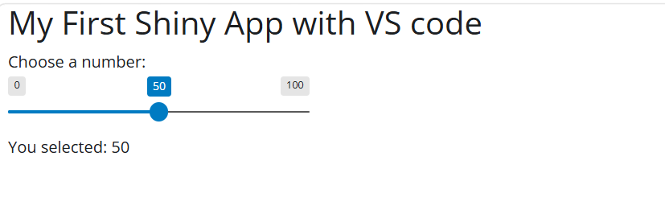

# Shiny Python App

This is a simple interactive web application built using **Shiny for Python**. The app demonstrates basic interactivity with a slider input and dynamic text output.

---

## 🚀 Features

* Interactive slider input
* Dynamic text output

---

## 💻 How to Run Locally

To run this application on your own machine, execute the following commands in your terminal:

```bash
# Install the required dependencies
pip install -r requirements.txt

# Run the Shiny application
shiny run app.py
```

---

## 🌐 Live App

You can access and test the application directly in your browser here:  
👉 **[Click here to view the Live App](https://whoistwa.shinyapps.io/shiny_with_python_projects/)**

---

## 📸 Preview



---

## 👨‍💻 Author

**Milse William NZINGOU MOUHEMBE**